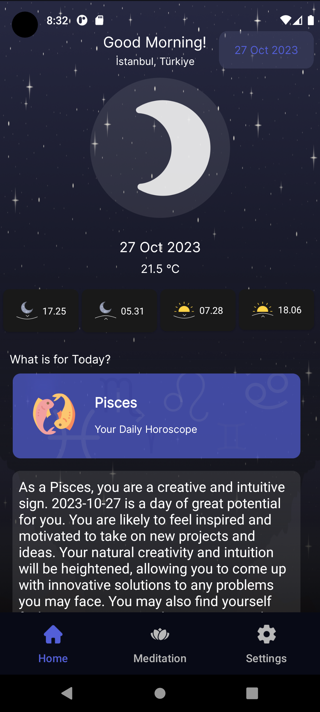

# MoonX
This application retrieves astronomical data based on user's input and provides horoscope interpretations for the selected date, either on a daily basis or by category, using the ChatGPT API. Additionally, users can relax by listening to meditation music within the app.
- MVVM
- Retrofit [Visual Crossing API](https://www.visualcrossing.com/resources/?s=astronomic) - [Open AI API](https://openai.com/blog/openai-api)
- DI - Hilt
- Jetpack Navigation
- Shared Preferences
- Coroutines
- Base Repository
- Live Data

&nbsp; &nbsp; &nbsp;
&nbsp; &nbsp; 

